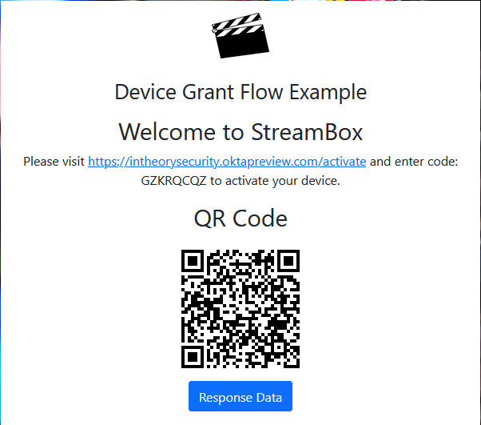

# Device Authorization Grant Flow Demo (Web)
This project allows you test Okta's Device Authorization Grant Flow within your browser.

For additional information about the Device Authorization Grantplease visit Okta Developer [page](https://developer.okta.com/docs/guides/device-authorization-grant/main).

## Prerequisites

* Okta Tenant - If you do not already an Okta tenant, you can register for a free [Okta Developer Editions](https://developer.okta.com/signup/)
* An OIDC applications to use Device Authorization Grant. [How-to](https://developer.okta.com/docs/guides/device-authorization-grant/main/#configure-an-application-to-use-the-device-authorization-grant)
* Node v14.0.0+
* npm v6.14.15+

## Installation and Configuration

1. Clone the repo.

```bash
git clone https://github.com/whitesand230/okta-deviceauthorizationgrant-demo.git
```

2. Install dependencies based on package.json.

```bash
npm install
```

3. Copy the contents of the .env.example file.

```bash
#Windows
copy .env.example .env

#Linux
cp .env.example .env
```

4. Update variables in the .env file.
```bash
OKTA_HOST=<OKTA URL>
CLIENT_ID=<APPLICATION CLIENT ID>
AUTHZ_ID=<OKTA AUTHZ ID>

#(Optional)
#Default Scopes are openid offline_access profile
SCOPES=<REQUIRED SCOPES>
#Defaults to false
DEBUG=<true||false>
```

5. Save the .env file.

## Usage

To start the express server, enter the following command

```bash
node server.js
```

6. Open http://localhost:8080 on your browser of choice. You will see the following screen.



## Contributing
Pull requests are welcome. For major changes, please open an issue first to discuss what you would like to change.

Please make sure to update tests as appropriate.

## License
[MIT](https://choosealicense.com/licenses/mit/)